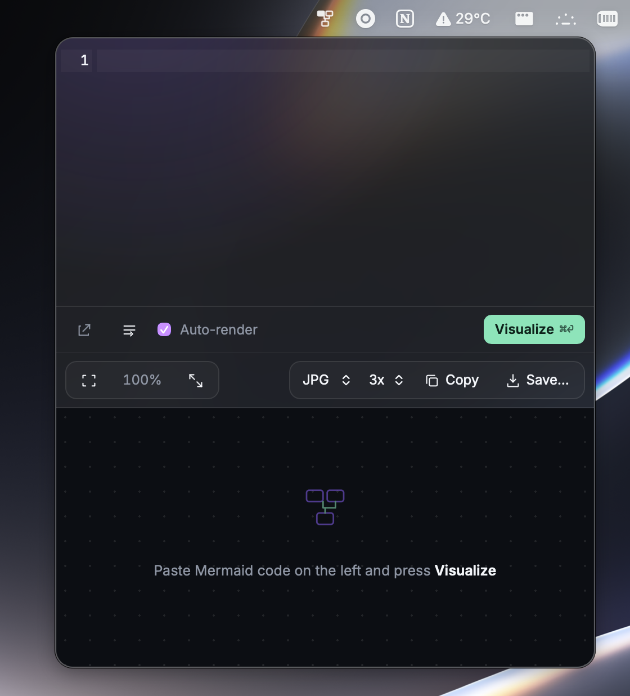
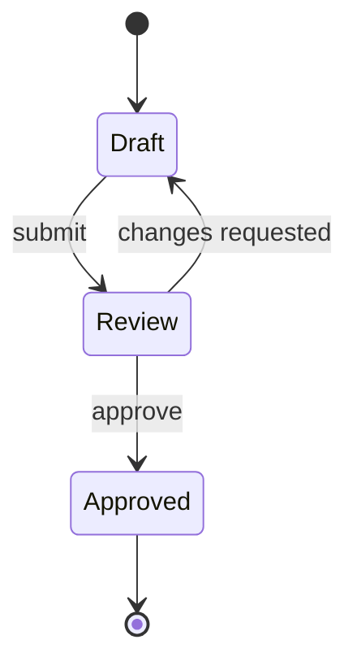

# Mermlaid

**Turn Mermaid your agents write into diagrams you can actually inspect.**

Claude and Codex are great at generating Mermaid. Mermlaid is the focused Mac app that makes the result visible instantly: open it from the menu bar, paste the code, inspect the flow, then export it without leaving your work.

[Download on the Mac App Store](https://apps.apple.com/us/app/mermlaid/id6797646690?mt=12) · [Open the web editor](https://mermlaid.dyvertex.com/) · [View source](https://github.com/zaxovaiko/mermlaid)

<p align="center">
  
</p>

<p align="center"><a href="https://apps.apple.com/us/app/mermlaid/id6797646690">
  
</a></p>

## 🧩 Make state diagrams readable

State diagrams are where generated Mermaid becomes most useful. Instead of reviewing a wall of transitions in a chat response, use Mermlaid to see every state, retry path, and terminal state at once.



Use it for approval flows, onboarding, async jobs, payments, and any system where the edge cases live in the transitions.

## ⚡ Features

- Tray / menubar popover, summoned with <kbd>Cmd/Ctrl</kbd>+<kbd>Shift</kbd>+<kbd>M</kbd>
- Live rendering as you type
- CodeMirror 6 editor with Mermaid syntax highlighting and toggleable line wrapping
- Pan and zoom the preview, fit to screen, reset zoom, fullscreen
- Copy the diagram to the clipboard as a bitmap or as SVG text
- Save as PNG, JPG or SVG at 1x / 2x / 3x scale
- Expand the popover into a full window, carrying the current code across
- Follows the system light/dark theme; code and settings persist between launches
- Great for flowcharts, sequence diagrams, architecture maps, and state machines

## ⌘ Install

Install [Mermlaid from the Mac App Store](https://apps.apple.com/us/app/mermlaid/id6797646690?mt=12), or use the [web editor](https://mermlaid.dyvertex.com/) for a quick diagram without installing anything.

Mermlaid is open source under the [MIT License](LICENSE). Build from source below if you want to contribute or adapt it to your workflow.

## 🛠 Development

Prerequisites:

- [Node.js](https://nodejs.org/) 20+ and [pnpm](https://pnpm.io/) 10+
- The [Rust toolchain](https://www.rust-lang.org/tools/install) (stable)
- Your platform's [Tauri system dependencies](https://tauri.app/start/prerequisites/)

```bash
pnpm install
pnpm tauri dev      # run the app with hot reload
pnpm tauri build    # release bundle in src-tauri/target/release/bundle
```

Checks:

```bash
pnpm build                                                      # typecheck + frontend build
cargo fmt --manifest-path src-tauri/Cargo.toml --check
cargo clippy --manifest-path src-tauri/Cargo.toml -- -D warnings
```

## 🗂 Project layout

| Path                 | What lives there                                              |
| -------------------- | ------------------------------------------------------------- |
| `index.html`         | Single page shared by the popover and the main window          |
| `src/main.ts`        | Wiring: toolbar, shortcuts, render pipeline, window events     |
| `src/editor.ts`      | CodeMirror setup                                               |
| `src/mermaidLang.ts` | Mermaid syntax highlighting                                    |
| `src/render.ts`      | Mermaid rendering and theming                                  |
| `src/panzoom.ts`     | Preview pan/zoom                                               |
| `src/export.ts`      | Rasterizing, clipboard copy, file export                       |
| `src/store.ts`       | Persisted settings                                             |
| `src-tauri/src/`     | Rust side: tray, global shortcut, window management, commands  |

## 🤝 Contributing

Bug reports, feature ideas and pull requests are welcome — see [CONTRIBUTING.md](CONTRIBUTING.md) and the [Code of Conduct](CODE_OF_CONDUCT.md). Security issues: see [SECURITY.md](SECURITY.md).

## 📄 License

[MIT](LICENSE) © zaxovaiko
